# SƠ ĐỒ LUỒNG HOẠT ĐỘNG HỆ THỐNG (SYSTEM FLOWS)
**DATT — Hệ thống Giám sát Thị giác Thông minh (AI Vision Monitoring & Security System)**

---

Tài liệu này mô tả chi tiết 10 luồng xử lý cốt lõi của hệ thống DATT bằng sơ đồ Mermaid chuẩn, phản ánh chính xác cấu trúc thực thi trong mã nguồn.

---

## 1. Luồng Xử lý Camera & Khung hình (Camera Processing Flow)

Mô tả chu trình từ khi camera tiếp nhận tín hiệu video, qua bộ điều tiết nhịp (Pacer), giải mã và đưa vào vòng lặp xử lý AI:

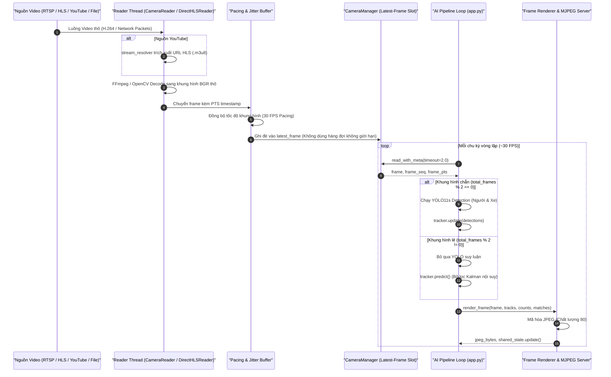

---

## 2. Luồng Trích xuất Đặc trưng Khuôn mặt (Face Recognition Flow)

Mô tả thuật toán xử lý khuôn mặt thích ứng đa tầng (Adaptive Face Pipeline) từ hộp bao người đến vector đặc trưng 512 chiều:

```mermaid
flowchart TD
    Start(["Khung hình BGR + Track người"]) --> CropROI["1. Cắt Vùng Thân Trên (Upper-Body ROI: top 55% Bounding Box)"]
    CropROI --> Pass1["2. Pass 1: SCRFD Face Detection (1.0x, det_thresh=0.35)"]
    Pass1 --> CheckPass1{"Tìm thấy khuôn mặt?"}
    
    CheckPass1 -- "Có" --> LandmarkCheck
    CheckPass1 -- "Không & ROI nhỏ (min_dim <= 320px)" --> Upscale["3. Pass 2: Phóng to ROI thích ứng (1.5x - 4.0x)"]
    Upscale --> Pass2["Chạy lại SCRFD nhạy (det_thresh=0.30 hoặc 0.26)"]
    Pass2 --> CheckPass2{"Tìm thấy mặt?"}
    CheckPass2 -- "Không" --> RejectFace["Bỏ qua khung hình này (WAIT_FOR_BETTER_FACE)"]
    CheckPass2 -- "Có" --> RescaleCoords["Quy đổi tọa độ về kích thước ROI gốc"]
    RescaleCoords --> LandmarkCheck

    LandmarkCheck["4. Kiểm định 5 Điểm mốc (Landmarks: Mắt, Mũi, Khóe miệng)"]
    LandmarkCheck --> ValidGeo{"Điểm mốc hợp lệ & Tỷ lệ tam giác dọc in [0.20, 0.88]?"}
    ValidGeo -- "Không" --> RejectGeo["Loại bỏ ứng viên (INVALID_GEOMETRY)"]
    
    ValidGeo -- "Có" --> CalcDistort["5. Tính Điểm méo góc cao (Overhead Distortion Score)"]
    CalcDistort --> CheckDistort{"Distortion >= 8.0 hoặc Aspect < 1.14?"}
    
    CheckDistort -- "Có" --> Homography["6. Áp dụng R2 Homography Rectification (Alpha=0.50, Aspect=1.1544)"]
    Homography --> SafeWarp{"validate_homography_safety = SAFE?"}
    SafeWarp -- "Không an toàn" --> FallbackRAW["Hồi phục về ảnh gốc (RAW_FALLBACK)"]
    SafeWarp -- "An toàn" --> NormCrop112
    FallbackRAW --> NormCrop112
    CheckDistort -- "Không méo" --> NormCrop112

    NormCrop112["7. Chuẩn hóa & Cắt khuôn mặt 112x112 pixel (norm_crop)"]
    NormCrop112 --> CalcQuality["8. Tính Điểm chất lượng ảnh (Sharpness, Frontality, Confidence)"]
    CalcQuality --> AdaFace["9. Đưa vào AdaFace IR50 Model (adaface_ir50_ms1mv2.onnx)"]
    AdaFace --> NormalizeL2["10. Chuẩn hóa vector L2 (512 chiều, ||v|| = 1.0)"]
    NormalizeL2 --> EndFace(["Ứng viên Khuôn mặt Sẵn sàng (Face Candidate)"])
```

---

## 3. Luồng Hợp nhất Ứng viên & So khớp Face Watchlist

Mô tả cách bộ đệm ứng viên (Candidate Buffer) tổng hợp đa khung hình và tính toán tương đồng Cosine:

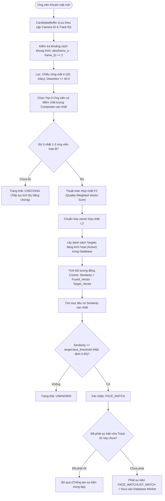

---

## 4. Luồng Nhận diện Biển số xe (Vehicle OCR Flow)

Mô tả chu trình cắt ảnh xe, định vị biển số bằng YOLO, tiền xử lý và giải mã OCR:

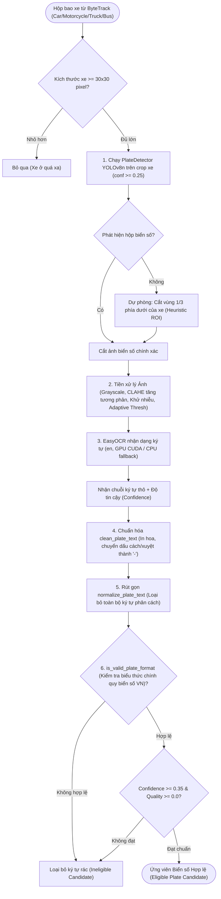

---

## 5. Luồng Đồng thuận Biển số & Đối soát Vehicle Watchlist

Mô tả cơ chế bỏ phiếu đa khung hình chống đọc sai và tra cứu danh sách đen:

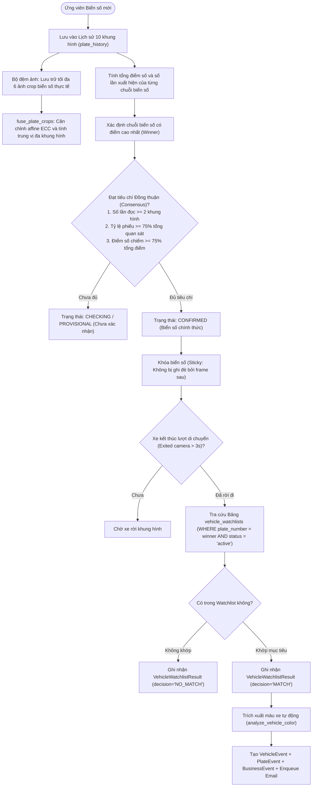

---

## 6. Luồng Khởi tạo Sự kiện Nghiệp vụ (Event Creation Flow)

Mô tả cách thức các loại sự kiện khác nhau được đóng gói và gửi vào hàng đợi lưu trữ bất đồng bộ:

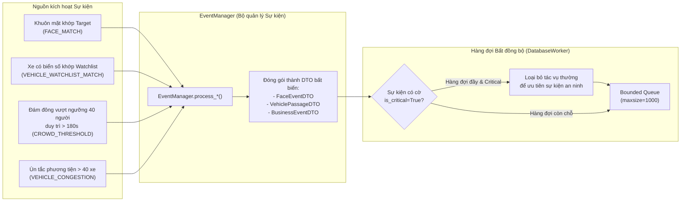

---

## 7. Luồng Khử trùng lặp và Hợp nhất Dữ liệu (Deduplication & Coalescing)

Mô tả 3 tầng bảo vệ chống bùng nổ dữ liệu và trùng lặp sự kiện:

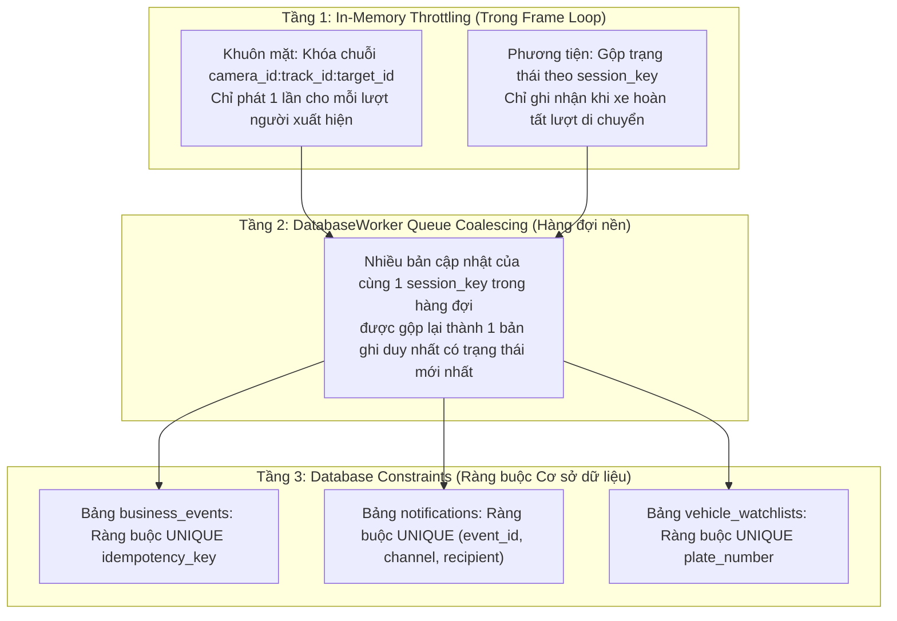

---

## 8. Luồng Vận chuyển Thông báo & Gửi Email (Notification / Email Flow)

Mô tả cơ chế Transactional Outbox, chống spam (Cooldown) và thử lại lũy thừa (Exponential Backoff):

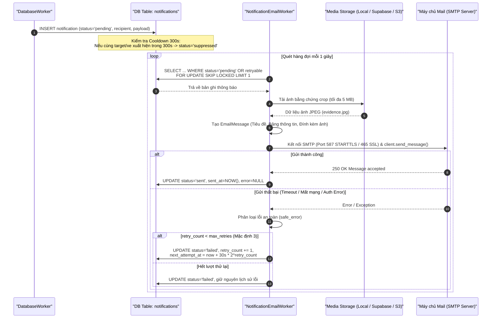

---

## 9. Kiến trúc Tương tác Cơ sở Dữ liệu (Database Interaction Architecture)

Mô tả cơ chế phân bổ kết nối an toàn cho PostgreSQL / Supabase Session Pooler và SQLite:

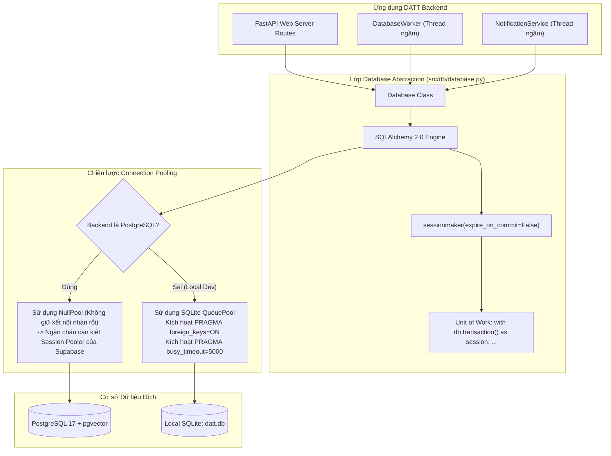

---

## 10. Kiến trúc Tương tác Frontend → API → Backend

Mô tả cách ứng dụng Single Page Application (SPA) tương tác với backend:

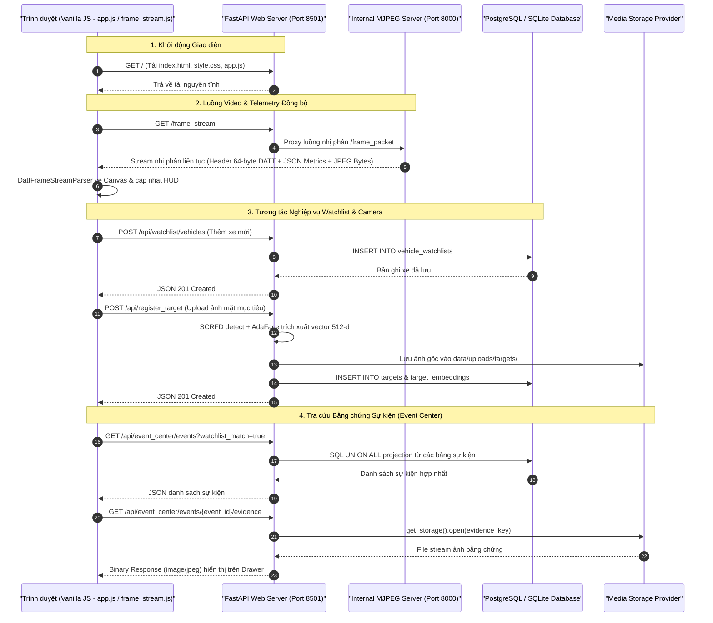

---

## 11. Luồng Chuyển đổi Giao diện Stream View & Fullscreen (Stream View & Fullscreen Transition)

Mô tả cơ chế chuyển đổi giữa giao diện quản lý có Sidebar dọc và giao diện xem luồng camera tối giản chuyên dụng:

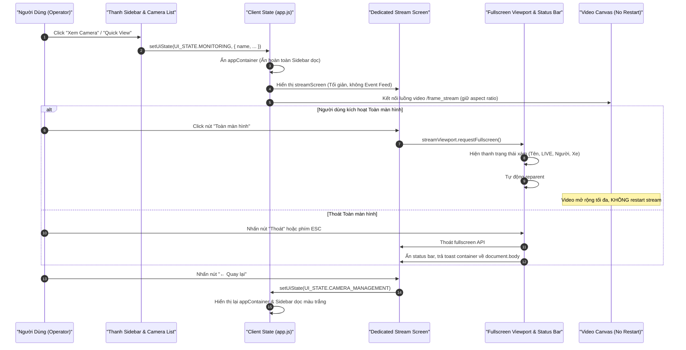

---

## 12. Luồng Cảnh báo Toàn cục & Đồng bộ Outbox Email (Global Alert Toast & Outbox Sync)

Mô tả chu trình phát cảnh báo tức thì góc trên bên phải màn hình dựa trên dữ liệu outbox bất đồng bộ:

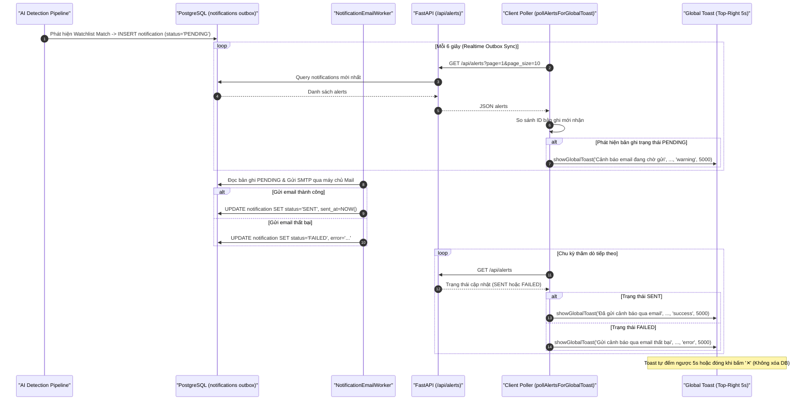
