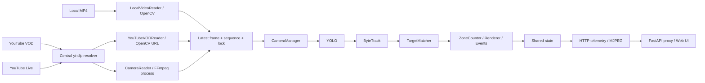

# DATT YouTube Live Readiness Audit

## 1. Executive Summary

**Current verdict: NO-GO.** Chưa nên chạy lại YouTube Live trên Colab. Có bằng chứng tái hiện việc watchdog giết FFmpeg mới bằng timestamp cũ, cleanup bị chặn khi đóng stdout trước khi terminate, và reader có thể spawn sau khi `stop()` đã trả về. HTTP 429 từ FFmpeg không đi qua cooldown 429 của resolver. Các lỗi này ảnh hưởng trực tiếp đến khả năng dừng, phục hồi và kiểm soát request.

Audit ngày 24/09/2026, repo HEAD `41873f8` (Phase 4.6), đối chiếu parent `f1ffb32` và working tree. Trong lúc audit, `src/stream/camera_manager.py` có thay đổi ngoài các thao tác của người audit; kết luận này áp dụng cho bản working tree cuối, không chỉ HEAD. Test đầu: 62 passed; test cuối: **61 passed, 1 failed**. Không sửa mã ứng dụng, không triển khai VPS, không chạy YouTube Live. Chỉ tạo báo cáo/harness và cài pytest vào venv để kiểm thử.

Local MP4 đã chạy qua YOLO thật trên CPU, ByteTrack, renderer, HTTP telemetry/MJPEG và đổi local → local thành công. YouTube VOD reader trực tiếp nhận được 5 frame thật, nhưng đường CameraManager/API VOD bị lỗi constructor. Colab/CUDA, độ ổn định Live và nhận diện khuôn mặt thật: **NOT VERIFIED**.

## 2. Current Architecture

Entrypoint [src/main.py](../src/main.py) → [RuntimeManager](../src/runtime/runtime_manager.py) → AI worker gọi [app.run_pipeline](../app.py), đồng thời web worker chạy FastAPI/Uvicorn. Internal HTTP/MJPEG mặc định `127.0.0.1:8000`; dashboard mặc định `0.0.0.0:8501` proxy tới internal server. Đây là các thread trong cùng process, không phải mỗi camera một AI process.

Sơ đồ VOD mô tả class reader; đường tạo reader qua manager hiện bị chặn bởi lỗi P1 bên dưới.

| Nguồn | Reader / decode | Thread / process | Buffer và EOF / stop |
|---|---|---|---|
| Local qua `set_video_source` | `LocalVideoReader`, `cv2.VideoCapture(file)` | Một reader daemon; không tạo FFmpeg subprocess riêng | Một latest frame, sequence, lock, copy khi đọc; pacing theo FPS. EOF seek về 0 nếu loop, kết thúc nếu không loop. Stop event và join 2 giây. |
| VOD trực tiếp | `YouTubeVODReader`, resolver lấy direct URL, **OpenCV mở URL đó** | Resolve đồng bộ trong start; một decode daemon | Latest frame. Open/reopen có retry, EOF được coi như read failure/recovery, chưa có hợp đồng loop VOD như manager đang truyền. Stop join 3 giây; blocking OpenCV chưa bảo đảm hủy được. |
| Live / HLS / RTSP | `CameraReader`; resolver cho YouTube, FFmpeg decode/scale BGR24 | Capture, stderr, health daemon và một FFmpeg subprocess trong luồng bình thường | Một `CapturedFrame`; đọc đủ `width*height*3` byte. EOF/partial frame dẫn tới reconnect; stop event và cleanup, join capture 5 giây. Có các lỗi lifecycle ở mục 5. |

Lưu ý đường `CameraManager.start_camera()` dùng cấu hình YAML luôn tạo `CameraReader`; không dispatch local/VOD giống `set_video_source()`. Không suy ra loại reader chỉ từ trường type trong YAML.

Đổi nguồn: manager giữ RLock, stop reader cũ, tạo/start reader mới, thay metadata. App so sánh camera ID rồi reset tracker, target tracks, counter và event state. YOLO nằm ngoài vòng lặp nên không reload khi đổi nguồn thông thường. Shared frame chưa được clear đồng bộ; `read()` lấy reader rồi thả lock nên frame từ reader cũ có thể vượt qua thời điểm switch.

## 3. What Was Actually Verified

Đã đọc code vận hành và test: entrypoint, app/config, runtime/shared state, stream/resolver/manager/readers, UI HTTP/FastAPI/JS, detector, tracker, counter, recognition/color, face embedder, event/storage, utils, camera YAML, requirements, notebook Colab, script thử nghiệm và tài liệu. Thư mục thực tế là `src/detector/` và `src/tracker/`, không phải `src/detection/` và `src/tracking/`. Các package placeholder không có pipeline riêng. Model/media/venv không được coi là mã nguồn cần diễn giải toàn bộ.

Evidence cục bộ nằm trong [results/readiness_audit](../results/readiness_audit/) (bị gitignore, không tự đi theo commit báo cáo):

| Evidence | Nội dung / giới hạn |
|---|---|
| `pytest.txt`, `pytest.xml` | Snapshot đầu: 62 passed, 3 warnings, 33.71 giây. |
| `pytest_final.txt`, `pytest_final.xml` | Working tree cuối: 61 passed, 1 failed, 3 warnings, 34.29 giây. |
| `probes.py`, `probes.json`, `probes_log.txt` | Probe API alias, diagnostics local, stale watchdog, stop trong resolver, 429 hai tầng, cleanup blocked pipe và switch local/VOD. Network/resolver/FFmpeg được mock trừ child pipe và file local. |
| `vod_simulate_network.txt` | Một lần yt-dlp simulate VOD qua mạng thành công. CLI mặc định khác option extractor của DATT, không thay cho smoke reader. |
| `vod_smoke.py`, `vod_smoke.json` | Reader VOD thật nhận 5 frame 640×360; stream FPS mẫu 23.28; resolver thành công 1, 429 = 0; thread chết sau stop. Harness giới hạn resolve retry = 1 để giảm request. Không chạy qua manager bị lỗi. |
| `local_pipeline_smoke.py`, `local_pipeline.json`, `local_pipeline_log.txt` | App pipeline thật, YOLO CPU 640, synthetic MP4 320×240. Chỉ override điểm chọn nguồn đầu vào trong harness để không mở camera YouTube mặc định; wrapper đếm model load vẫn gọi constructor thật. |

Local smoke: load YOLO **1 lần**, xử lý **8 frame**, telemetry frame ID **5 → 9** sau đổi local qua internal API, MJPEG nhận 2.048 byte có JPEG header; pipeline stop thành công, chỉ còn `MainThread`. Synthetic clip không có người nên không kiểm chứng chất lượng phát hiện hoặc ID continuity trên người thật. Frame ID của shared state không phải tổng số inference, không dùng nó thay metric `total_frames`.

Shell wrapper của local smoke trả exit 1 khi PowerShell ghi native stderr warning; JSON và log cho thấy pipeline hoàn tất, không có `smoke_error`, stop sạch. Vì vậy kết luận dựa vào các assertion/giá trị artifact, không ghi đây là một command exit-code PASS.

**NOT VERIFIED:** Colab mới cài, GPU/CUDA inference, browser UI trực quan, Live network, network stall thật kéo dài, signed URL hết hạn thật, 429/403 thật, VOD end-to-end qua manager → YOLO, InsightFace với khuôn mặt thật, khả năng chịu tải nhiều client, độ trễ wall-clock và ổn định RAM nhiều giờ.

## 4. Fixed Issues Verified

| Hạng mục từng cần sửa | Kết quả xác minh hiện tại |
|---|---|
| `KeyError: ffmpeg_alive` | **Đã sửa trong working tree cuối:** manager dùng `.get()`, fallback reader alive. Probe ép trạng thái WARNING rồi đọc local trả frame và RUNNING khi diagnostics không có `ffmpeg_alive`. |
| Latest-frame phía Python | **Có:** latest slot + lock + sequence; buffer không xếp hàng frame cho YOLO. `deque(maxlen=30)` của Live chỉ chứa timestamp đo FPS. |
| YOLO không reload khi switch | **Đúng cho local smoke:** một constructor, AI và MJPEG tiếp tục sau switch. |
| Reset tracker/target | **Có trong code:** app reset khi ID đổi; manager cuối cũng reset target tracks. Unit/E2E hỗ trợ logic; không chứng minh race-free cho switch network. |
| VOD tránh OpenCV direct URL | **Chưa sửa:** `_read_loop_impl` vẫn dùng `cv2.VideoCapture(self._direct_url)`. Một VOD đọc thành công không loại bỏ rủi ro timeout/cancel. |
| `type` / `source_type` nhất quán | **Chưa sửa:** handler lấy `data.get("type", "local")`; probe gửi `source_type=youtube_vod` bị forward thành `type=local`. |
| Local ↔ VOD switch / cleanup toàn bộ | **Chưa đạt:** constructor VOD fail. Không dùng local stop sạch để suy ra network reader cũng sạch. |

## 5. Remaining Problems

Các fix sau chỉ là đề xuất; chưa áp dụng.

| ID / Severity | File / Function | Problem và impact | Recommended minimal fix |
|---|---|---|---|
| P1 **HIGH**; chặn VOD readiness | `src/stream/camera_manager.py::set_video_source`, `video_source.py::YouTubeVODReader.__init__` | Manager truyền `loop` mà constructor không nhận. Sau đó còn truy cập `reader.width/height` chưa có. Test switch fail ngay; VOD không tới AI qua API. | Đồng bộ hợp đồng reader/manager, xác định rõ EOF/loop và kích thước; kiểm thử switch thật trước Live. |
| P2 **BLOCKER** Live recovery | `youtube_stream.py::read`, `_spawn_ffmpeg` | Watchdog dùng `_last_frame_timestamp` của process cũ; process mới chưa có frame bị terminate ngay nếu timestamp cũ >15 giây. Probe xác nhận terminate process vừa start. | Reset/lưu timestamp theo generation; timeout first-frame riêng từ process start, không dùng timestamp đời trước. |
| P3 **BLOCKER** stop / switch | `youtube_stream.py::_cleanup_process` | `stdout.close()` trước terminate có thể chờ lock của blocking read. Probe real child chỉ cleanup xong sau timer bên ngoài kill child ở ~1.203 giây. Timeout `wait(2)` chưa được chạm tới khi mắc ở close. | Terminate/kill process trước để unblock read; serialize quyền cleanup, join thread rồi đóng pipe trong thứ tự có deadline. |
| P4 **BLOCKER** lifecycle | `youtube_stream.py::stop`, `_reconnect`; `youtube_resolver.py::resolve_stream_url` | Stop chờ capture 5 giây rồi trả khi resolver vẫn chạy; sau resolve vẫn spawn dù stop đã set. Probe thấy thread còn sống và spawn sau stop. Có nguy cơ ingest cũ tồn tại lúc nguồn mới start. | Cancel-aware wait/extraction hoặc guard sau mỗi blocking step và trước spawn; không công bố stop thành công khi worker chưa chết; một owner lifecycle. |
| P5 **BLOCKER** 429 readiness | `youtube_stream.py::_reconnect`, `_read_loop_impl`; `youtube_resolver.py` | FFmpeg 429 chỉ force refresh/clear URL, không cập nhật global cooldown/429 metric. Probe hai lần lỗi vẫn resolve/spawn hai lần, cooldown=0, 429 metric=0. | Đưa HTTP status của decoder vào chung rate-limit policy; circuit breaker/cooldown và retry budget, tôn trọng Retry-After nếu lấy được. |
| P6 **HIGH** | `video_source.py::YouTubeVODReader._read_loop_impl`, `stop` | OpenCV direct signed URL không có deadline/cancel rõ; EOF và lỗi mạng nhập chung. Open thành công reset attempt có thể làm chuỗi open→EOF lặp lâu hơn max retry. | Decode network bằng infrastructure có timeout/stop kiểm soát được; tách EOF, URL-expiry, open failure; giới hạn toàn chu kỳ recovery. |
| P7 **HIGH** | `ui/web_server.py` và `ui/video_stream.py` source handlers | Payload `source_type` bị default local. Proxy timeout có thể trả trước khi backend switch/resolve xong. | Chuẩn hóa schema hai lớp, hỗ trợ alias hoặc reject rõ; trạng thái operation pending và chống submit trùng. |
| P8 **HIGH** | `youtube_resolver.py::resolve_stream_url` | Check/register `_in_flight` ở các critical section khác nhau; waiter timeout 60 giây có thể tạo owner mới, finally owner cũ pop registry mới. Semaphore serialize extraction nhưng không bảo đảm chỉ extract một lần. | Register owner nguyên tử; waiter không tự thay owner đang sống; cleanup theo identity/token. |
| P9 **HIGH** | `runtime/runtime_manager.py::start_ai_pipeline`, startup; `app.py::run_pipeline` | Bắt mọi TypeError rồi chạy lại pipeline không stop_event; camera khởi động trước bind server và ngoài try/finally. Bind lỗi có thể bỏ lại reader. Start không có guard instance đã chạy. | Bỏ fallback TypeError rộng; lifecycle try/finally bao từ lúc tạo resource; start idempotent, startup fail phải stop hoàn toàn. |
| P10 **MEDIUM** | `camera_manager.py::read/set_video_source`; `app.py`; `shared_state.py` | Frame đang đọc từ nguồn cũ có thể trả sau switch; metadata đổi trước frame, shared frame không clear. | Generation token cho source/frame, bỏ frame cũ; clear shared frame và reset state atomically khi chuyển nguồn. |
| P11 **MEDIUM** | `youtube_resolver.py` cache / URL normalization | Cache key chỉ video ID, không phân Live/VOD; TTL 4h không kiểm tra signed expiry. Bare ID có nhánh tạo literal `watch?v=video_id`. New Live reader invalidate cache ngay startup. | Key bao gồm chế độ; expiry có safety margin; sửa nội suy ID; chỉ invalidate khi có lý do lỗi/expiry. |
| P12 **HIGH** Colab readiness | `requirements-colab.txt`, notebook setup | Danh sách chưa đủ direct runtime deps, chưa bảo đảm EJS/runtime; model/GPU thực tế Colab chưa xác minh. Unpinned supervision có warning ByteTrack sẽ bị loại bỏ ở 0.31. | Khai báo/pin bộ dependency đã kiểm chứng, boot clean Colab, provision model, verify GPU và local smoke trước mạng Live. |
| P13 **MEDIUM** | `app.py`, `shared_state.py`, reader metrics, `web_server.py` fallback | `stream_health` chưa được cập nhật trong pipeline; restart/drop metrics không tăng; thiếu counter 403/EOF, resolve attempts. Backend offline có fallback source RUNNING dễ gây hiểu nhầm. | Wiring snapshot thật, monotonic counters tối thiểu; offline phải phản ánh unavailable. |
| P14 **MEDIUM** | `video_source.py::LocalVideoReader._read_loop`; `app.py::run_pipeline` | Local file hỏng/không frame và loop có thể seek/retry không sleep. Hai list latency trong app append suốt phiên, tăng RAM theo runtime dù frame buffer bounded. | Stop/backoff khi EOF không có frame; dùng running sum/count hoặc bounded window thay list không giới hạn. |
| P15 **MEDIUM** | `youtube_stream.py::_read_loop`, `stop/start` | Outer exception không có finally cleanup bao toàn worker; health/stderr không join; restart cùng object giữ một số state cũ. | Cleanup đảm bảo mọi exit path, join tất cả owned thread, reset lifecycle state theo generation. |
| P16 **LOW/MEDIUM** | `recognition/target_matcher.py` | Unmatched track có thể match lại mỗi frame; face embedding cache theo track, TTL cleanup phụ thuộc luồng track. Có thể ảnh hưởng inference latency khi bật face. | Định nghĩa lại reevaluation/cache eviction cho cả matched/unmatched; benchmark có target thật. |

## 6. YouTube Request / 429 Analysis

### yt-dlp calls và cache

`get_stream_url()` chỉ resolve YouTube URL/ID; URL khác đi thẳng decoder. Không resolve theo frame, health poll hoặc telemetry poll. Live startup chạy `_reconnect`; nếu thành công ngay, một lời gọi resolve được thực hiện. Đây **không có nghĩa một HTTP request**: yt-dlp có thể gọi nhiều endpoint/client/manifest cho một extract.

Resolver có cache TTL 4 giờ, ngưỡng failure 3, semaphore mặc định 1 và khoảng cách extract tối thiểu 3 giây **trong một process**. Không có coordination giữa nhiều notebook/process. New Live reader đi qua nhánh refresh, invalidate trước resolve, nên không bảo đảm reuse cache khi switch trở lại. Cache không tự refresh mỗi frame hoặc theo timer nền; TTL chỉ được kiểm tra lúc resolve.

Live thử direct URL tối đa `STREAM_DIRECT_RECONNECT_RETRIES=3` trước refresh. `_direct_reconnect_attempts` không reset khi frame khỏe trở lại, nên các lần lỗi cách xa nhau vẫn cộng vào hạn mức. Khi chưa có URL, forced refresh hoặc đã hết direct retry, mỗi recovery attempt có thể gọi resolver; khi fail kéo dài, vòng ngoài vẫn retry vô hạn với khoảng nghỉ có trần.

### FFmpeg và reconnect

HTTP có `-reconnect 1`, `-reconnect_streamed 1`, `-reconnect_delay_max 5`, `-rw_timeout 15000000`; RTSP dùng TCP. Python cũng có `_reconnect()` với dãy delay **3, 5, 10, 20, 40, 60, 120, 300 giây**, cộng jitter tối đa 5 giây; startup đầu khi chưa có URL có thể chờ 0. Thành công nhận frame reset reconnect attempt. Docstring nói tối đa 5 retries đã lỗi thời: implementation retry đến khi stop.

Có **hai tầng recovery**. Bình thường Python đợi pipe/FFmpeg, không có bằng chứng mọi reconnect đều spawn hai process đồng thời. Tuy nhiên FFmpeg tự retry trong lúc Python watchdog có thể terminate, rồi Python mở lại và có thể resolve lại; P2/P4/P5 làm tăng churn. Không được coi `reconnect_delay_max` là giới hạn tổng số request.

EOF/partial frame: nếu FFmpeg còn sống thì cho phép dưới ngưỡng 10 read failure, nghỉ 0.05 giây; vượt ngưỡng hoặc process chết thì cleanup/reconnect. Stale >15 giây được kiểm tra trong `read()` của consumer, không phải health thread; không có frame đầu thì điều kiện timestamp >0 không kích hoạt watchdog. Status RUNNING ≤5 giây, WARNING ≤15 giây, ERROR sau đó. Health thread chỉ log mỗi 10 giây, tài nguyên mỗi 60 giây, không mở mạng.

### Hai đường HTTP 429 khác nhau

**429 do yt-dlp:** exception → tăng `http_429_count` → đặt global cooldown → exponential backoff base10, jitter0..5 → retry tối đa3 trong một execute. Probe fake clock bỏ jitter thấy extract tại t=1000,1010,1030; cooldown cuối đến1070; ba 429 và một failure. Không parse Retry-After. Backoff max120 chưa đạt với ba lần 10/20/40. Vòng CameraReader bên ngoài có thể gọi lại sau đó; retry budget không giới hạn suốt phiên.

**429 do FFmpeg:** stderr chứa429 → `_force_url_refresh=True`, URL=None → cleanup → chờ delay reconnect phía Python → invalidate cache → yt-dlp → spawn. Không gọi cùng policy cooldown429, metric429 vẫn0 trong probe. Một lần vừa hồi phục có thể quay về delay nhỏ sau lần lỗi kế tiếp. Đây là lý do không thể kết luận “429 đã an toàn” chỉ từ test resolver.

403 không có policy/counter riêng: decoder retry direct rồi refresh sau khi hết hạn mức; extractor error không429 trả lỗi về outer loop. Chưa tái hiện 403 thật. URL hết hạn có thể cần refresh, nhưng phải có budget để không refresh vô hạn khi nguyên nhân là permission/IP.

### Normal HLS và request dư

Playlist refresh, segment request, đọc segment kế tiếp là hoạt động bình thường; không tự động coi là bug. Audit chưa capture request ở cấp HTTP cho Live nên **không có số request/phút thực đo**.

Request dư có đường code cụ thể: cache bị invalidate ở startup reader mới, dedup race/timeout, switch khi reader chưa chết, startup trùng, watchdog giết process mới, FFmpeg429 refresh lại. UI polling thông thường không tạo source; nút submit có khóa pending, nhưng timeout proxy không đồng nghĩa backend đã hủy. Multiple process có resolver riêng nên semaphore1 không ngăn nhiều nguồn ingest.

**Risk:** có nguy cơ retry amplification và ingest trùng trên các đường lỗi đã nêu; không khẳng định đã quan sát storm thật vì không chạy Live/429 thật. Các probe đủ để chặn readiness.

## 7. Process & Resource Safety

**FFmpeg:** nominal single owner spawn là capture thread, watchdog terminate trong `read`, stop cũng cleanup; ownership chưa được serialize đầy đủ. Đã chứng minh blocked-pipe cleanup và spawn-after-stop. Chưa chứng minh không zombie trong network failure thật. Probe child được timer của harness kill và reap, không kill process không thuộc audit.

**Threads:** local reader switch lặp có baseline/final Python threads 1/1, child processes 0/0; old local threads alive=0. VOD trực tiếp stop bình thường cũng sạch. Không mở rộng kết luận đó sang Live hoặc OpenCV bị kẹt mạng. Stop timeout đơn thuần không chứng minh thread đã chết.

**RAM/latency:** frame latest slot bounded, nhưng FFmpeg/network/OpenCV còn buffer nội bộ. Tuổi latest frame đo từ lúc decode/capture không phải độ trễ so với thời gian thực ở camera YouTube. Hai list latency app tăng suốt phiên; chưa đo slope RAM dài hạn. `dropped_frames` không được tăng nên giá trị0 không chứng minh không bỏ frame.

**GPU/recognition:** YOLO thực chạy CPU được. CUDA và VRAM Colab **NOT VERIFIED**. TargetMatcher màu dùng HSV; face embedder lazy load InsightFace/ONNX, có thể tải buffalo_s vào cache người dùng. Không có target thì smoke không kích hoạt face. Test embedding mock không xác minh nhận diện người thật.

**Ports:** validate 8000/8501 trước start hữu ích nhưng check rồi release không reserve port. Chưa reject hai port bằng nhau; headless không có port guard; notebook chạy process mới không tự dừng process cũ. Camera đã start khi internal bind mới chạy, nên phải cleanup cả lỗi startup. Shutdown join AI có giới hạn nhưng chưa đảm bảo worker kết thúc. Kiểm tra port rảnh không đồng nghĩa không còn headless reader.

### Colab environment audit

| Thành phần | Máy audit / code | Colab readiness |
|---|---|---|
| Python | Windows Python 3.11.9 | Runtime Python Colab thực tế **NOT VERIFIED**; cần smoke import cùng phiên bản dependency. |
| torch/CUDA | torch 2.14.0+cpu, CUDA False | GPU **NOT VERIFIED**; không suy ra từ local CPU. |
| Ultralytics/model | YOLO11s model local load và inference thành công | Model trong `models/` bị ignore Git; cần provision và kiểm tra path trên runtime mới. |
| OpenCV | 4.11.0 | Colab khai báo headless>=4.8; tránh cài đồng thời nhiều distribution cv2. |
| FFmpeg | 9.0.1 full build local, có libsrt | Binary/codecs/protocols của Colab **NOT VERIFIED**. |
| yt-dlp | 2026.08.19, VOD resolve thành công | Dependency không pin; snapshot Windows không chứng minh extractor hoạt động ở IP Colab. |
| JS/EJS | Node24.12.0; simulate báo Deno2.9.7, Node chưa enabled; package yt-dlp-ejs thiếu | Cần JS runtime được yt-dlp chọn và solver tương thích, không chỉ có lệnh node. |
| FastAPI/Uvicorn/HTTPX/YAML/multipart | Có trong môi trường local hiện tại | `requirements-colab.txt` chưa khai báo đầy đủ các direct deps này. Import app chưa chắc thành công trên clean runtime. |
| Streamlit | Có trong Colab requirements | UI chính hiện tại là FastAPI; giữ Streamlit nếu chạy dashboard legacy, không thay thế Uvicorn. |
| InsightFace/ONNX | Local có package; face model thật chưa load trong audit | Optional cho face feature; phải provision trước khi bật face, kiểm tra provider và chi phí CPU/GPU. |
| supervision | Local0.30.3 có warning ByteTrack removal0.31 | `>=0.22` không có upper bound có thể nhận bản phá API; pin/upgrade có kiểm chứng. |

Theo [tài liệu EJS chính thức của yt-dlp](https://github.com/yt-dlp/yt-dlp/wiki/EJS), Node yêu cầu tối thiểu22 và phải enable runtime Node; Deno được enable mặc định, tối thiểu2.3. PyPI `yt-dlp[default]` cung cấp dependency EJS tương thích. Cần kiểm chứng theo [dependencies của yt-dlp](https://github.com/yt-dlp/yt-dlp#dependencies), không coi cài plain `yt-dlp` và có Node trong PATH là đủ. Resolver hiện chưa cấu hình rõ JS runtime/solver.

Không tìm thấy absolute Windows path trong đường production inference/stream cần sửa để chạy Linux; path VSCode/tài liệu cũ và artifact audit là đặc thù local. `PROJECT_ROOT/models/yolo11s.pt` portable về cách dựng path, nhưng file model không tự đi theo clone. Colab fresh-install và notebook end-to-end vẫn **NOT VERIFIED**.

### Telemetry tối thiểu trước Live

| MUST HAVE | Hiện có / phần cần bổ sung |
|---|---|
| Source type, generation, reader alive, FFmpeg alive/PID | `/video_source` có nhiều trường reader diagnostics; main telemetry chưa đầy đủ, generation thiếu. |
| Frames received, input FPS, inference FPS, frame age | Có ở reader/shared state; phải phân biệt age lúc capture với end-to-end latency. |
| Cumulative reconnect và FFmpeg starts | reconnect attempt reset khi khỏe; `stream_restarts` chưa tăng, cần counter cumulative thật. |
| yt-dlp attempts, cache hit/miss, cooldown remaining | total_resolves chỉ thành công; cần count attempt kể cả thất bại và cooldown rõ. |
| 429,403,EOF,read errors và reason cuối | 429 mới đếm ở resolver; 403/EOF chưa có counter; read errors chủ yếu log. |
| Runtime, RAM, VRAM | Có phần log/HUD; cần snapshot theo chu kỳ và lưu để so trend. |
| Backend unavailable và stop state trung thực | Không dùng fallback RUNNING khi upstream offline. |

NICE TO HAVE: p50/p95 latency, end-to-end clock overlay, bytes/segment rate, buffer occupancy nội bộ, dashboard đồ thị dài hạn. Không cần dựng hệ thống monitoring mới để làm controlled test; structured log + snapshot định kỳ đủ nếu các MUST HAVE chính xác.

### VPS relay trong tương lai

AI pipeline nhận ndarray nên có thể giữ nguyên khi thay nguồn bằng relay. `CameraReader` truyền non-YouTube URL thẳng FFmpeg; RTSP/TCP và HTTP có nhánh option sẵn. Manager dynamic chỉ nhận type local/vod/youtube/live; URL relay có thể đi qua type live, nhưng cần type/label rõ nếu mở UI chính thức.

SRT có thể truyền qua generic FFmpeg input nhưng **NOT VERIFIED**: không có nhánh SRT/options riêng, cần build có libsrt và xác minh mode/latency/timeout. Local build có libsrt không chứng minh Colab build có. VPS relay có thể tách YouTube ingest khỏi Colab, nhưng không tự sửa P2–P5; relay cũng cần một owner, cooldown và giới hạn request. Chưa triển khai bất kỳ VPS nào.

## 8. Test Results

Lệnh full suite đã chạy với venv: `python -m pytest tests -v` kèm log/JUnit. Bao gồm bốn module yêu cầu và các module stream/resolver/runtime/UI/events khác; không chỉ chạy chọn lọc một test thuận lợi.

| Test / nhóm | Kết quả | Evidence / giới hạn |
|---|---|---|
| Full suite snapshot đầu | PASS:62 | Trước thay đổi working tree manager được phát hiện. |
| Full suite working tree cuối | **FAIL:61 pass,1 fail** | `pytest_final.xml/txt`; đây là kết quả áp dụng cho verdict. |
| `tests/test_video_sources.py::TestVideoSources::test_runtime_video_source_switch_and_release` | **FAIL** | `YouTubeVODReader.__init__() got an unexpected keyword argument 'loop'`, manager bọc thành RuntimeError. Chặn VOD/switch readiness. |
| `tests/test_target_matcher.py` | PASS trong full suite | Logic matching, có mock; không chứng minh nhận diện face thật. |
| `tests/test_target_api.py` | PASS trong full suite | API test; không đồng nghĩa nguồn network hoạt động. |
| `tests/test_e2e_target_tracking.py` | PASS trong full suite | Synthetic video, real tracker/color/render, detection boxes mô phỏng; không phải YOLO/GPU accuracy test. |
| Stream/resolver/runtime/UI/event tests còn lại | PASS trong full suite | Nhiều fixture mock; test cleanup mock không đủ chứng minh không leak ngoài mạng. |
| Local reader loop/switch probe | PASS trong phạm vi local | Clip20 frame; mỗi lượt đọc22 frame/1.3s, FPS~16.1, CPU~0.047–0.063s/lượt; old thread0. Không thấy runaway trên clip hợp lệ. |
| Local→VOD→Local→VOD→Local | **FAIL cho VOD** | Hai lần VOD đều lỗi constructor; local phục hồi, baseline/final thread1 và child0. Không ghi toàn chuỗi PASS. |
| Local AI + HTTP/MJPEG smoke | PASS theo artifact | YOLO thật CPU, model load1, 8 inference, UI stream bytes và telemetry tăng sau switch, stop sạch. Chưa browser visual QA. |
| yt-dlp simulate VOD | PASS | Một invocation thành công qua mạng; không livestream. |
| DATT VOD reader trực tiếp | PASS cho resolve+decode+stop | 5 frame thật, reader thread chết sau stop. VOD→AI qua manager **NOT VERIFIED/BLOCKED P1**. |
| Stale-new-process, stop-during-resolve, close-before-terminate probes | **FAIL safety** | Tái hiện P2/P3/P4 trong `probes.json`. |
| FFmpeg429 policy probe | **FAIL safety** | Hai resolve/spawn, metric4290, cooldown0 với injected429. Không gây429 thật trên YouTube. |

Warnings: Starlette/HTTPX integration deprecation, AnyIO BlockingPortal deprecation, supervision ByteTrack future removal. Không có cơ sở bỏ qua ByteTrack warning khi install dependency mới không pin.

### Checklist readiness

| Tiêu chí | Status | Evidence |
|---|---|---|
| Local MP4 | PASS | Loop, CPU sample, AI/MJPEG và local switch thật. |
| YouTube VOD | FAIL | Reader trực tiếp được, manager path P1/P6 chưa đạt. |
| Local ↔ VOD switch | FAIL | Hai lỗi constructor và test suite fail. |
| All tests pass hoặc failures đã hiểu rõ | WARN | 61/62, nguyên nhân P1 đã rõ nhưng chưa sửa. |
| No KeyError diagnostics | PASS | Working tree dùng get; local recovery probe. |
| No zombie FFmpeg | FAIL | Cleanup bounded chưa đạt P3; không khẳng định có zombie OS đã quan sát. |
| No thread leak | FAIL | P4 stop trả về khi reader còn sống. |
| No duplicate AI pipeline | WARN | Nominal một pipeline; guard/retry startup P9 chưa an toàn. |
| No duplicate YouTube reader | FAIL | Spawn-after-stop cho phép overlap khi switch. |
| Latest-frame semantics | PASS | Python latest slot; không cam kết mọi upstream buffer bằng0. |
| FFmpeg lifecycle | FAIL | P2/P3/P4/P15. |
| yt-dlp resolve bounded | WARN | Per-call retry/semaphore có, dedup và global-session budget chưa đạt. |
| Live reconnect bounded | FAIL | Delay có trần nhưng vòng retry vô hạn, chưa cancellation-safe. |
| 429 không gây retry storm | FAIL | FFmpeg429 bỏ qua chung cooldown; chưa thể bảo đảm. |
| 403 handling reasonable | WARN | Generic retry/cache refresh; chưa phân loại hay test thật. |
| Stale watchdog reasonable | FAIL | Timestamp cũ giết process mới; thiếu first-frame watchdog. |
| Colab dependencies | FAIL | Manifest thiếu direct deps, fresh boot chưa xác minh. |
| Node/EJS | WARN | Local VOD được nhưng clean Colab/runtime/solver chưa xác minh. |
| GPU pipeline | WARN | NOT VERIFIED, máy audit CPU. |
| API/UI source switching | FAIL | Alias và VOD lỗi; local internal API được. |
| Telemetry đủ quan sát Live | FAIL | Cumulative starts/attempts/HTTP error counters và wiring thiếu. |
| Port/process startup clean | WARN | Port check có nhưng P9/race/headless còn tồn tại. |
| Frame/target state reset khi switch | WARN | Reset code có, source generation/shared frame atomicity chưa có. |

## 9. Livestream Test Plan

**Chưa thực hiện kế hoạch này vì NO-GO.** Đây là kế hoạch sau khi sửa và audit lại blocker, không phải cho phép chạy ngay.

Điều kiện vào: đóng P2–P5/P9/P15, sửa P1/P7 để control path dùng được, test cancellation/cleanup/dedup, full suite xanh; clean Colab install và local GPU smoke; VOD qua API→real frames→AI→switch/stop; chỉ một runtime/reader, port8000/8501 thuộc đúng process; telemetry MUST HAVE hoạt động.

| Stage | Thời lượng | Phạm vi và tiêu chí đi tiếp |
|---|---|---|
| 1 | 5 phút | Một Live source, một UI client, không bật face hoặc switch stress. Frames tăng, tuổi frame ổn định, không429/403, không process dư, resolve không lặp khi nguồn khỏe. Stop xong reader/FFmpeg chết và port đóng. |
| 2 | 15 phút | Chỉ sau stage1 đạt; cùng source và settings. Theo dõi reconnect/resolve/start count, RAM/VRAM trend; một stop/start có chủ đích sau khi session trước cleanup xong. |
| 3 | 30 phút | Chỉ sau stage2 đạt; kiểm tra độ ổn định dài hơn, một lần đổi local rồi trở lại Live theo quy trình chờ cleanup. Không cố tình gây429 hoặc spam switch. |

Ghi snapshot mỗi5 giây: source/generation, PID/thread alive, frames_received, input/inference FPS, frame age, cumulative reconnect/resolve attempts/FFmpeg starts, cooldown,429/403/EOF/read errors, runtime,RAM,VRAM. Ghi lifecycle event ngay khi xảy ra. Lưu count process/thread trước start và sau stop. Các stage không tự nối tiếp nếu chưa review log và stop sạch.

## 10. Abort Conditions

Các ngưỡng sau là giới hạn đề xuất cho controlled test, không phải tính năng hiện có:

- Bất kỳ HTTP429: stop test, không refresh thủ công/restart liên tục; lưu log và tôn trọng cooldown/Retry-After nếu có.
- Có hơn một FFmpeg ingest hoặc hơn một reader cho source đang test, hay process xuất hiện sau stop.
- Hơn2 recovery/start hoặc resolve không chủ đích trong60 giây; resolve lặp dù frame khỏe.
- Frame age >15 giây hoặc tăng liên tục qua3 snapshot mà không phục hồi có kiểm soát.
- 403 lặp sau một recovery có kiểm soát; EOF/read errors lặp không có frame mới.
- RAM tăng liên tục qua6 snapshot và không ổn định sau warmup; vượt budget RAM đã đặt cho runtime. GPU OOM bất kỳ.
- UI mất hình trong khi pipeline vẫn retry; telemetry unavailable hoặc báo RUNNING sai trạng thái.
- Stop vượt deadline10 giây, thread/process không chết hoặc port không nhả: không mở session mới, xử lý đúng process đang sở hữu resource trước.

## 11. Final Verdict

**NO-GO.** Chưa đủ an toàn để thử lại YouTube Live trên Google Colab.

Bằng chứng quyết định là watchdog terminate process mới, cleanup bị kẹt trước terminate, spawn sau stop và FFmpeg429 không vào resolver cooldown. Ngoài ra, VOD control path đang regression, Colab dependency/runtime/GPU chưa được xác minh, telemetry chưa đủ phân biệt recovery khỏe với request churn.

Local AI/MJPEG và VOD decode trực tiếp đã được chứng minh trong phạm vi ngắn. Những kết quả đó không loại bỏ các blocker network/lifecycle. Bước tiếp theo là sửa tối thiểu các lỗi nêu trong báo cáo khi được yêu cầu, chạy lại kiểm thử tương ứng và readiness review; chưa chạy Live dài hạn.
